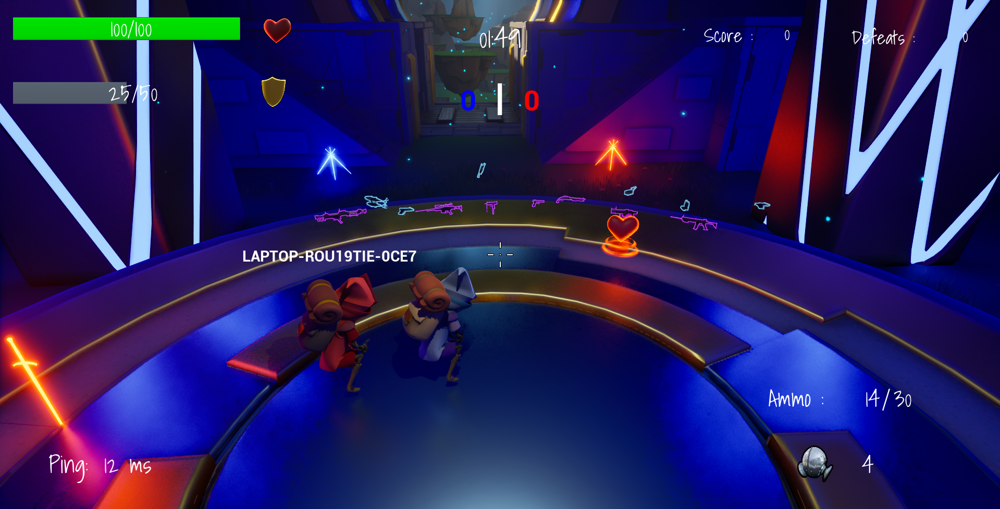

# Blast
演示视频：https://www.bilibili.com/video/BV12VwszqEZY/

一个基于 Unreal Engine 5.6 开发的多人联机 TPS 项目，重点实现了团队对战、夺旗模式、组件化战斗系统，以及面向高延迟场景的服务端回溯命中判定。

## 项目概览

- 项目类型：多人联机 TPS
- 引擎版本：Unreal Engine 5.6
- 核心方向：多人对战、网络同步、HUD 反馈

## 项目亮点

### 服务端修正高延迟命中校验

实现了 Lag Compensation 组件，在服务端缓存角色历史 HitBox 数据，并基于客户端上报时间进行 Server Rewind，用于修正高延迟环境下的命中判定。

- Hitscan 及时命中确认
- Shotgun 霰弹枪多目标命中确认
- Projectile 弹道回溯确认

### 组件化战斗系统设计

战斗能力集中由 CombatComponent 和 BuffComponent 管理，角色本体只负责输入与表现，便于后续扩展武器、Buff、交互物与新玩法。

### 玩法模式完整

- Team Match 团队对战
- Team Capture Flag 夺旗模式

### 展示效果完善

项目已具备较完整的 HUD 与战斗反馈，包括准星扩散、血量、护盾、弹药、手雷、倒计时、击杀公告、队伍比分、高 Ping 提示、角色淘汰特效和领先玩家特效等。

### 多种武器系统

支持以下武器类型：

- Assault Rifle
- Rocket Launcher
- Pistol
- SMG
- Shotgun
- Sniper Rifle
- Grenade Launcher

### Buff 与拾取物

- Health PickUp、Shield PickUp、Ammo PickUp、Speed PickUp、Jump PickUp、Flag

## 技术难点

### 1. 高延迟场景下的命中公平性

普通客户端开火在多人环境下容易出现看到命中但服务端未确认的问题。为此，项目实现了服务端回溯逻辑，通过缓存角色历史碰撞盒状态，在服务端按客户端开火时刻重建目标状态并重新检测命中。

### 2. 多类型武器的统一抽象

命中扫描、抛射物、霰弹枪在判定方式和同步方式上差异很大。通过武器类型划分与 CombatComponent 调度，将不同开火路径统一到同一套战斗流程中，降低了扩展成本。

### 3. 多人战局 HUD 同步

HUD 不只是展示本地数据，还需要同步比赛阶段、分数、倒计时、击杀播报和网络状态。本项目将这部分逻辑收敛到 PlayerController 与 HUD 体系中，保证战局反馈一致性。
